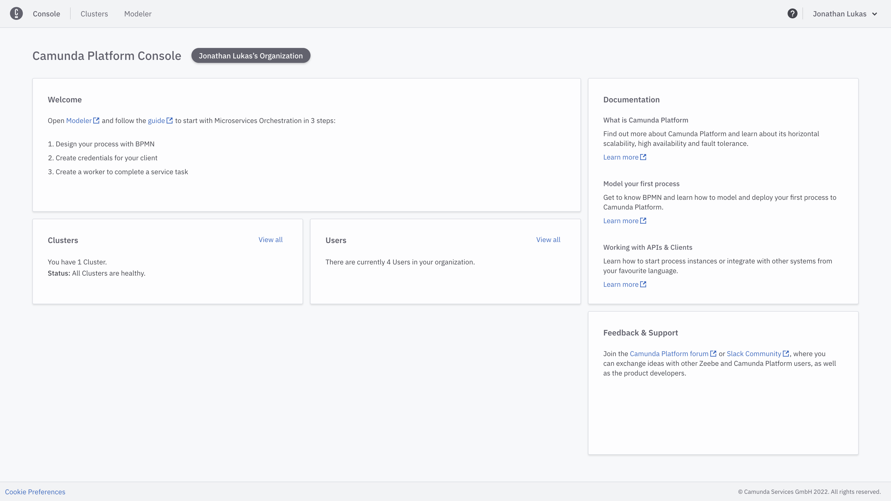
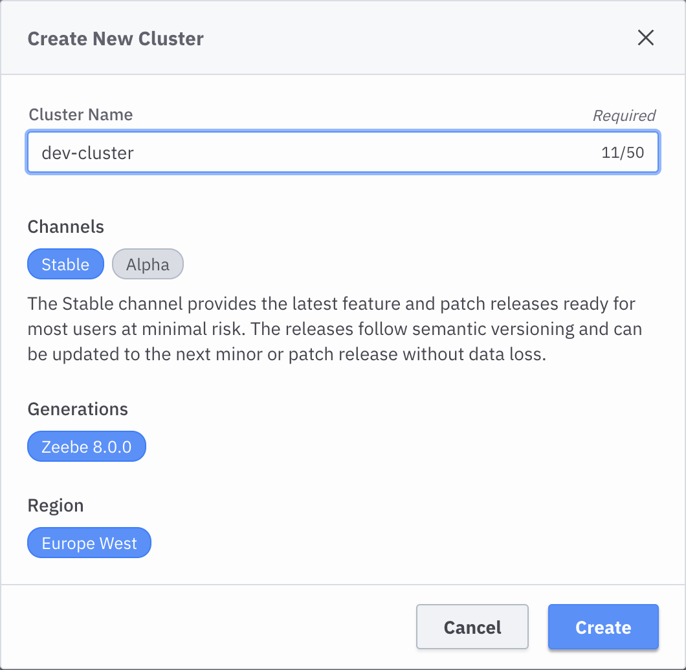

## Background

After having modelled and aligned on our process diagram we are now going to discover the capabilities of Camunda 8.

### Task: Try out Camunda 8 features

Camunda Platform 8 is powered by Zeebe, a new class of BPMN workflow engine that delivers true horizontal scalability and enables high-performance use cases that were once beyond the realm of workflow automation.

The Camunda 8 Console https://console.cloud.camunda.io/ acts as an entry point to Camunda Platform 8. After having logged in or signed up for a trial you will be redirected to the landing page.

From this page onwards you can do various things:

* It's the home of the Organization you are part of. So you can manage your team members accordingly.

* Open up the Web Modeler to create some awesome collaborative BPMN models.

* Get to manage your Clusters i.e. to boot up a new one or to access an existing one.

* And of course you have quick access to various knowledge resources.

Since you have already modeled a process in the previous task lets take a look at our Clusters for now. If you have not created one yet make sure to create a new one. Make sure to set a suitable name. 

After some time the cluster has been created and you should be able to see how the various applications are switching to healthy.

As soon as this has happened you are ready to use them by clicking the launch button. For now we do not need to create a Client as the orange notification suggests. That will be part of the next exercise.

Now it is your task to familiarize yourself with these tools. Let's quickly sum up what they are actually doing. Keep in mind that we are going to revisit them in more depth during the next exercise.

* Zeebe: A new class of BPMN workflow engine that delivers true horizontal scalability and enables high-performance use cases. https://docs.camunda.io/docs/components/zeebe/zeebe-overview/

* Operate: A tool designed for teams to manage, monitor, troubleshoot running workflow instances. https://docs.camunda.io/docs/components/operate/

* Tasklist: It is an out-of-the-box web application that’s tightly integrated with Camunda’s process orchestration capabilities. Simply model a business process and deploy it to the Workflow Engine; when a user needs to work on a task, they’ll see it appear in Tasklist. https://docs.camunda.io/docs/components/tasklist/introduction/

* Optimize: Create business-friendly reports and dashboards as well as alerts that help you identify process bottlenecks and improve your overall end-to-end process. https://docs.camunda.io/docs/components/optimize/what-is-optimize/

Enjoy experimenting around!
