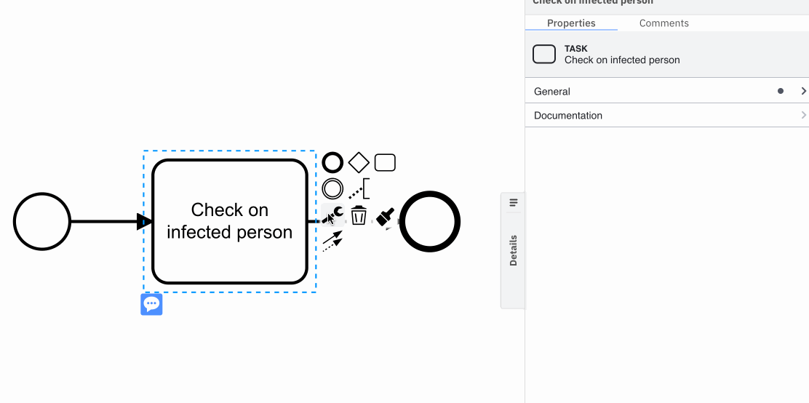
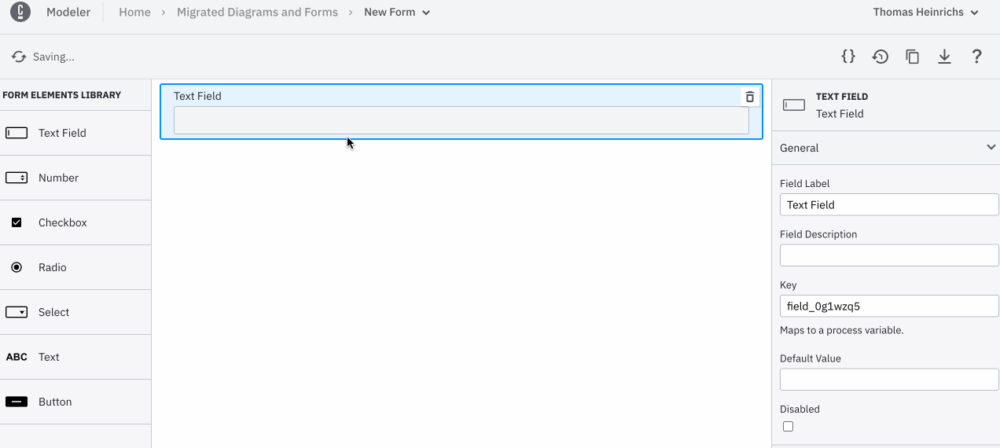
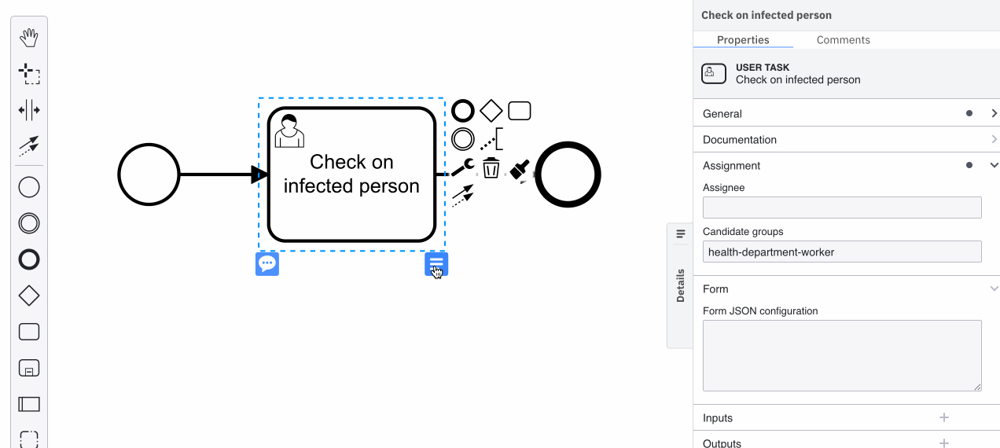
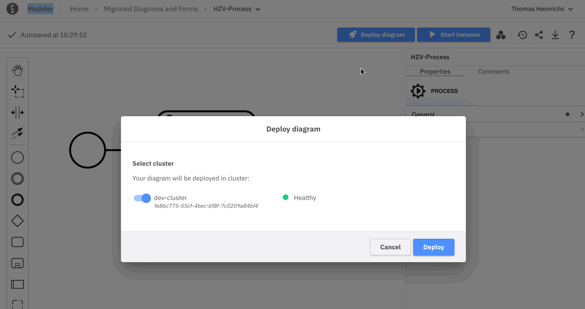

## Background

We have created a process in our Camunda Platform 8 environment during exercise 1 already. In this section we want to deploy this process after having added Camunda Forms to a User Task.

### Task: Add User Tasks and a Form to the User Tasks

In the animated image below - showing a single user task - you can see how to change the type of activity. After having done so we can change some User Task specific properties such as the assignee. In addition, you can find an empty property for a form in there. 

After accomplishing that we can now focus on creating a Form by using an intuitive form builder. You can select to create a new one in your Modeler project. The form builder allows you to drag and drop common elements used for forms onto a canvas. Of course, you can set certain properties right in there. After finished configuring your form you can also take a log on the JSON based representation. 

    Now feel free to create a meaningful form for your User-Task

After having accomplished that we need to figure out how to attach to a Form to a User Task. Please go back to your BPMN Model and select your task for this purpose. Now you have two possibilities:

* Either you can click on the "blue context menu" to choose and import an available Form

* Or you can copy the JSON shown before and add it manually to the "Form JSON configuration"

Now we are good to deploy our process model to the engine! Click the "Deploy Diagram" Button to see if there aren't any syntactic mistakes in your model. Afterwards you can start a process instance by clicking on the related button. You should now be able to observe the progress in Operate and work on the User Task in Tasklist.

In the end you will be able to see that the process has ended successfully. 

Congratulations! 🎉 You have managed to start and execute your first process instance containing only a User Task! Now you have earned yourself a little break. ☕️🥐