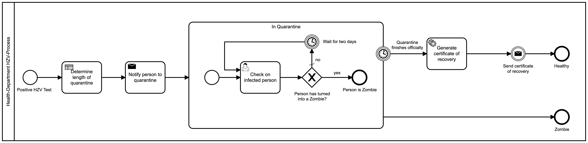

## Background

Now, we are ready to automate the process we have created and aligned on. Below you can find a representation of that process.

### Task: Automate the process

To automate this process three steps need to be automated:

* Notify the person to quarantine
* Generate certificate of recovery
* Send certificate of recovery

Automation in Camunda Platform is implemented using the external worker pattern. "Glue code" is code that you write in a worker to glue the automation to external services. For some background on this pattern and the glue code, refer to the Job Worker section of the Camunda 8 documentation https://docs.camunda.io/docs/components/concepts/job-workers/, and this blog post: How to write glue code without Java Delegates in Camunda Cloud https://blog.bernd-ruecker.com/how-to-write-glue-code-without-java-delegates-in-camunda-cloud-9ec0495d2ba5 

The automation can be done in any language you prefer. We provide solutions in Node.js, .NET, and Spring Boot.

You can find a more detailed solution in the language-specific readme.

* Node.js
* .NET
* Spring Boot

Bonus Challenge: If you have additional time, you may like to investigate Camunda 8 Connectors https://docs.camunda.io/docs/components/modeler/web-modeler/connectors/. These are reusable glue code workers combined with an element template that specifies their configuration parameters.