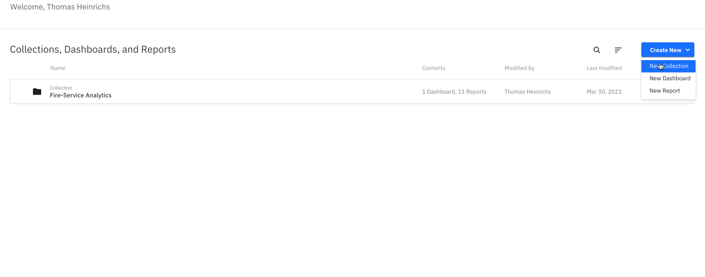
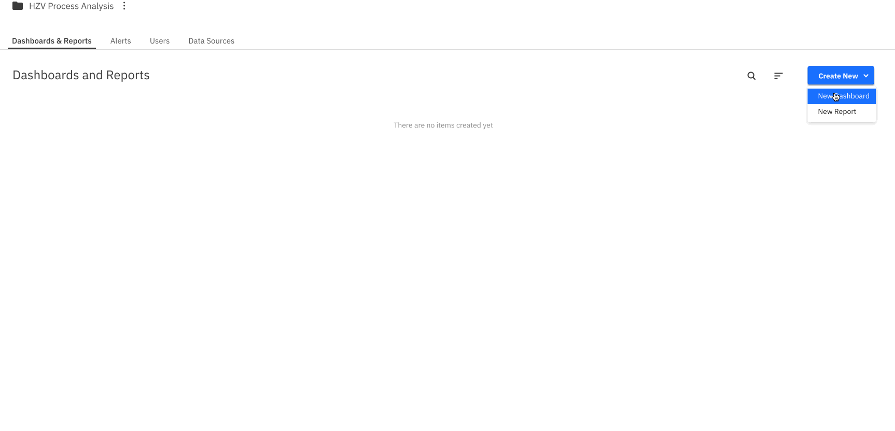

## Background

Having automated the process and tried it out multiple times, we are ready to analyse the process in Optimize.

### Task: Use Optimize to analyze the process

This tool helps you to create business-friendly reports and dashboards as well as alerts that help you to identify process bottlenecks and improve the overall performance of your end-to-end process.

To get started, please launch the Optimize application from your Cluster and create a new collection for our reports and dashboards. Remember to select the HZV process as shown below. 

After doing this, we can see our process definition showing up as a data source. In this view we could also add more users to our collection or define alerts which will be triggered when a certain report falls below or reaches above a threshold. To start with, we can create a dashboard. To do so in just a few clicks we can make use of a template. 

Now you can modify these reports, and play around with this tool to discover all its possibilities.